# 🖥️ Git in Visual Studio Code: A Beginner-Friendly Interface

While the **Git CLI** is powerful, it can feel overwhelming for beginners.
**Visual Studio Code (VSCode)** offers a built-in **Git extension** that
simplifies most Git operations with a clean and visual workflow.

This guide highlights how to perform essential Git tasks in VSCode, and how it
compares to the command line.

---

## 📄 File Status & Git Sidebar

- Click the **Source Control icon** on the left sidebar.
- VSCode displays:
  - Modified files
  - Staged changes
  - Untracked files
  - Conflicts (with markers)

> ✅ You can **stage** files with a simple click ➕, and **discard** changes
> with a trash icon.

---

## ✅ Committing Changes

**CLI:**

```bash
git add .
git commit -m "Your message"
```

VSCode:

    You can stage them all with the + sign or press on the commit button.


> 💡 VSCode also highlights changes line-by-line, letting you commit file chunks
> ("hunks") individually.

## 🚀 Pushing to GitHub

CLI:

```bash
git push origin your-branch
```

VSCode:

    After committing, click the … menu in the Source Control tab → Push

    Or click the sync icon (🔄) in the status bar

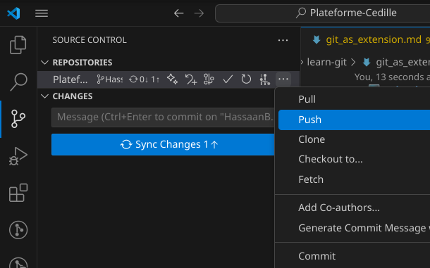

## ⬇️ Pulling Latest Changes

CLI:

```bash
git pull origin main
```

VSCode:

    Click … → Pull

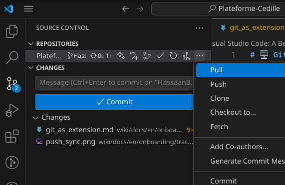

    Or click the sync icon in the bottom-left corner

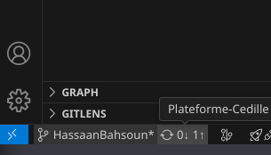

    Conflicts, if any, will be visually flagged in the editor

## 🔄 Fetching (Without Merging)

CLI:

```bash
git fetch
```

VSCode:

    Use … → Fetch to retrieve remote updates without merging them automatically

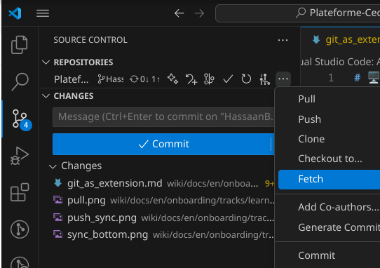

> 🧠 Useful for previewing changes before pulling.

## 🌿 Creating a New Branch

CLI:

```bash
git checkout -b feature/branch-name
```

VSCode:

    Click on the branch name in the bottom-left corner

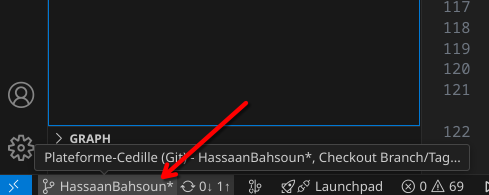

    Select Create New Branch…  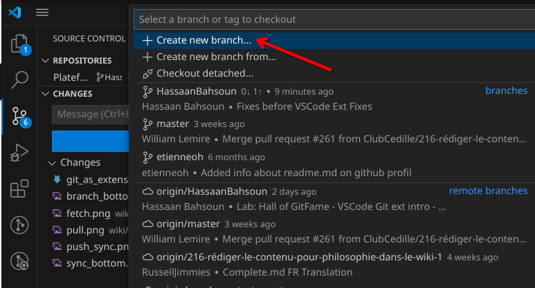

    Enter a name and select the base branch (usually main)

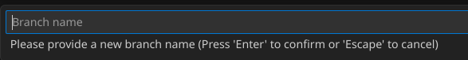

## 🔁 Switching Branches

CLI:

```bash
git checkout branch-name
```

VSCode:

    Click the branch name in the bottom-left corner

    Select the branch you want from the dropdown list

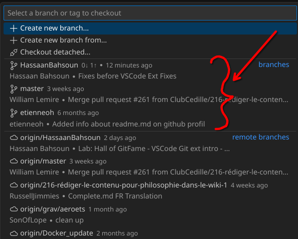

> 🔄 No need to remember branch names — they're listed for you.

## 🧹 Deleting a Branch

CLI:

```bash
git branch -d branch-name
git push origin --delete branch-name
```

VSCode:

    Go to Source Control → ... → Branch 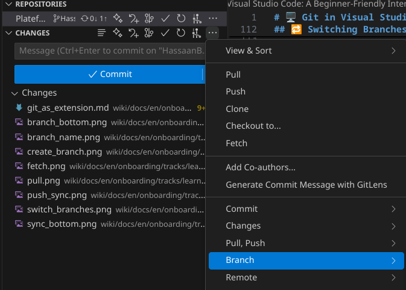

    Branch → Delete Branch...  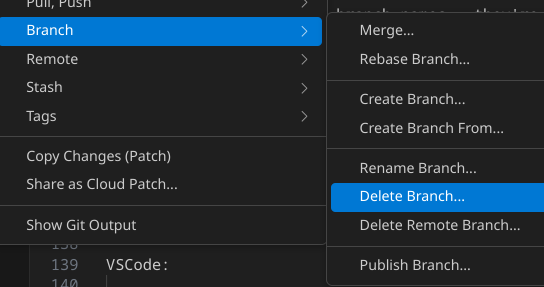

> ⚠️ VSCode will ask for confirmation before deleting locally or remotely.

## 🔀 Merging Branches

CLI:

```bash
git checkout target-branch
git merge source-branch
```

VSCode:

    Go to Source Control → ... → Branch


    Branch → Merge...  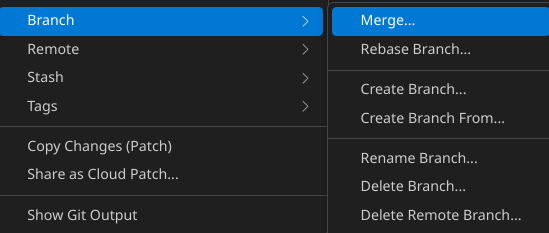

> 📌 VSCode alerts you about incoming conflicts and allows side-by-side
> resolution.

## ⚔️ Resolving Merge Conflicts

VSCode shines here with visual tools:

- Conflicting lines are highlighted with:

```diff
+ <<<<<<< HEAD
your changes
=======
incoming changes
+ >>>>>>> other-branch
```

- Buttons appear above: Accept Current, Accept Incoming, Accept Both, or
  Compare.

This makes conflict resolution much more manageable than the CLI.

## Conclusion

VSCode makes Git accessible and visual — perfect for beginners

You can still use the Git CLI at any time via the built-in terminal

Learn the CLI eventually, but let VSCode guide your workflow early on.

We're at the end, go to the [next page](./git_complete.md).
