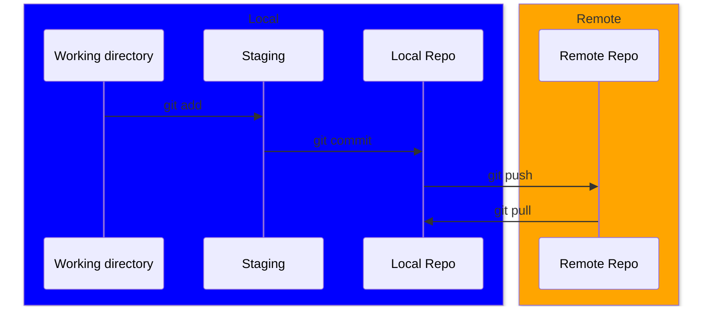

# Introduction to Source Control & Git

## What is Source Control?

Source control, or version control, is a system that helps **manage** and
**track changes** in any digital project over time, which is code in our case.

It is especially useful for us since developping any software is a team effort,
and a system is needed to allow everyone to **collaborate together** without
overwriting everyone's changes.

Additionally, a source control system enables a **detailed history of changes**,
allowing someone to easily **revert** to an earlier version without ever losing
a single line of code.

You have probably used some form of Source Control in your life if you've
collaborated with a team on any of Google's office suite (Ex. Docs,Sheets)! They
allow collaboration on the same document, and provide a history of the changes
made.

### Why do you need a source control system ?

- _Collaboration_: An entire team can work together on the same project, without
  stepping on anyone's foot
- _Backup_: Any line of code that has been pushed to the source control, will be
  there forever, no matter what
- _Track changes_: Easily find who added what to a project
- _Branching_: Allows the isolation of certain experimental features on a
  project, without impacting the main project.

---

## Git (A quick overview)

A source control system is just a bunch of ideas, which anyone can take and
create their own functional integration. For us (_and most of the world_), we
use [**Git**](https://git-scm.com/). > Git is a free and open source distributed
version control system designed to handle everything from small to very large
projects with speed and efficiency.

It was created in 2005 by Linus Torvalds (Creator of Linux) to help the
collaborators of the Linux kernel (the heart of a operating system) work
together. It has since stood the test of time, and is used by a vast majority of
software developpement team.

It works very well for any project's sizes, while staying
efficient. Furthermore, it is a _distributed system_, which means everyone
working on a project has a local access to the entire history, without the need
for a centralized server.

### Git's workflow

Git has 3 primary areas where all the action happens:

1. **Working directory**: This is the actual files you will be writing your code
   to !

2. **Staging area**: This a a buffer zone where your changes are stored before
   commiting them.

3. **Repository (local/remote)**: Also known as a _repo_, this is where all your
   changes are stored permanently. You have a local repository which can be
   different from the remote repository since Git is a _distributed_ system.

Git has over a 150 different commands to interact with it ! In our case, we will
focus on the following four, and we will see a couple more later on.

1. **`git add`**: Add or move a change from the working directory into the
   staging area.

2. **`git commit`**: Saves the changes you've added from the staging area into
   your local repo.

3. **`git push`**: When you are happy with all your changes in your local repo,
   it is time to push it into the remote repo and make it available to anyone
   working on the project !

4. **`git pull`**: As the name suggests, _pull_ retrieves any changes on the
   remote repo into your local repo. If you've recently `git push` new changes
   into the remote repo, your colleagues will need to use `git pull` to have
   acces to them in their own local repo.

5. **`git status`**: Shows the current state of your project. It helps you see
   which files are modified, staged, or untracked—so you know what to do next.

_we can ignore `git checkout` for now._

---

When you are ready, go on to the [next page](intro_github.md) !
