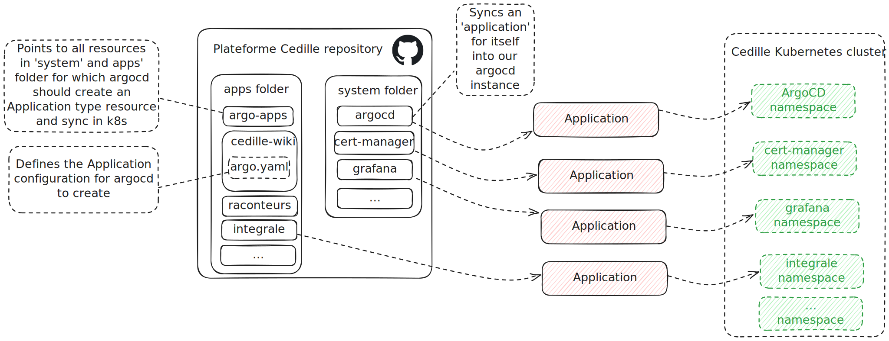

# Existing Applications

## System

### Mayastor

#### Current Configuration Description

Mayastor is a distributed block storage system implemented with the NVMEoF
protocol. Among other things, it allows access and replication of data across
all nodes in the Kubernetes cluster.

Currently, we maintain two copies of all data at all times:

```yaml
# /system/mayastor/storageclass.yaml
apiVersion: storage.k8s.io/v1
kind: StorageClass
metadata:
  name: mayastor
  annotations:
    storageclass.kubernetes.io/is-default-class: "true"
parameters:
  ioTimeout: "30"
  protocol: nvmf
  repl: "2"
  stsAffinityGroup: "true"
provisioner: io.openebs.csi-mayastor
```

##### Justification for Choice

Compared to other solutions like Ceph:

- Very simple to deploy and configure
- Low system and component complexity
- Designed from the start for use in Kubernetes

For example, we made several attempts to install Ceph, but the system was
unstable for the small cluster size and poorly suited for use in Kubernetes.

##### Deployment References

- <https://www.talos.dev/v1.5/kubernetes-guides/configuration/storage/#mayastor>
- <https://mayastor.gitbook.io/introduction/quickstart/deploy-mayastor>

#### Usage

The `StorageClass` mayastor is selected by default by Kubernetes. Simply create
`PersistentVolumeClaims`
(https://kubernetes.io/docs/concepts/storage/persistent-volumes) and the volumes
will be created in Mayastor automatically.

### ArgoCD

ArgoCD is our GitOps system. It handles deploying and synchronizing all YAML
resources in our `Plateforme-Cedille` repository. We use Kustomize to group all
`Application` type resources in the `/apps/argo-apps/` folder.

Here is a visual overview of this structure:



#### ArgoCD Image Updater

The ArgoCD Image Updater is a tool that automatically updates the image tags of
a deployment in ArgoCD. It is configured to update the image tags of the
`Application` resources in the `/apps/argo-apps/` folder for which an annotation
`argocd-image-updater.argoproj.io/image-list` is present :

```yaml
apiVersion: argoproj.io/v1alpha1
kind: Application
metadata:
  name: example
  namespace: argocd
  annotations:
    argocd.argoproj.io/sync-wave: "2"
    argocd-image-updater.argoproj.io/image-list: website=ghcr.io/clubcedille/example:latest
    argocd-image-updater.argoproj.io/website.update-strategy: digest
    ...
```

For now, we use the digest strategy to update the image tags. An example can be
found in the `/apps\integrale\website\argo.yaml` application deployment file.

#### Configuration

**RBAC Permissions** The RBAC (Role-Based Access Control) configuration in
ArgoCD allows defining specific security policies for different users and
groups. In our case, we have defined roles within our organization that
correspond to the various levels of access needed.

Operators (role:org-operators), who are members of the ClubCedille:SRE group,
have the following permissions:

- Obtain information about clusters, certificates, and repositories
- Synchronize, create, and delete applications
- Read, create, update, and delete GPG keys

These permissions are configured via lines starting with p in the
`system/argocd/argocd-values.yaml` file under `policy.csv`. The \* indicates that
the action is allowed for all instances of the specified resource.

The relationships between GitHub users/groups and ArgoCD roles are defined by
lines starting with g. For example, all members of the ClubCedille:SRE group on
GitHub are assigned the role role:org-operators in ArgoCD, and ClubCedille:Exec
are assigned the admin role.

**SSO Integration with GitHub** ArgoCD is configured to use GitHub's OAuth2 as
an authentication provider. This allows members of our GitHub organization to
log in to ArgoCD with their GitHub credentials.

### Ingress - Contour

Contour is an Ingress Controller solution for Kubernetes. It uses the Envoy
proxy server as a backend.

#### Configuration

The Envoy proxy service has been configured with a NodePort to direct external
traffic to Contour, which then routes the requests to the dedicated services.

#### Testing

Start by deploying a web application like [httpbin](https://httpbin.org/#/).
From the project directory:

```bash
kubectl apply -f apps/testing/httpbin.yaml
```

Then verify that the 3 pods reach a **Running** status:

```bash
kubectl get po,svc,ing -l app=httpbin
```

To use Contour and Envoy, we will use the `kubectl port-forward` function to
direct traffic to Envoy:

```bash
kubectl -n projectcontour port-forward service/envoy 8888:80
```

Then visit http://local.projectcontour.io:8888/. For our production environment,
we would use the address of the Envoy service.

For more information on Contour, see [the official
documentation](https://projectcontour.io/docs/).

### KubeVirt

KubeVirt extends Kubernetes functionality by adding virtual machine workloads
alongside containers.

#### Configuration

KubeVirt is configured to allow the execution and management of virtual machines
within the Kubernetes cluster. It is necessary to have
[krew](https://krew.sigs.k8s.io/) installed.

#### Testing

To test an Ubuntu virtual machine, execute this command:

```bash
kubectl virt vnc ubuntu-vm -n vms
```

#### Containerized Data Importer (CDI)

To create your own VM from an ISO, you need to use KubeVirt's
[CDI](https://kubevirt.io/user-guide/operations/containerized_data_importer/)
which is already installed on our cluster.

To do this, create a PVC (in this situation, the Ubuntu 22.04.3 ISO will be
imported into the PVC):

```yaml
apiVersion: v1
kind: PersistentVolumeClaim
metadata:
  name: iso-ubuntu-20-04
  namespace: vms
  labels:
    app: containerized-data-importer
  annotations:
    cdi.kubevirt.io/storage.import.endpoint: "https://releases.ubuntu.com/jammy/ubuntu-22.04.3-desktop-amd64.iso" # Required. Format: (http||s3)://www.myUrl.com/path/of/data
spec:
  accessModes:
    - ReadWriteOnce
  resources:
    requests:
      storage: 6Gi
```

Once applied, a pod will be created in the respective namespace. In this
situation, the pod will be created in vms. This pod allows you to see the
progress of the ISO installation in the PVC. To see the progress:

```bash
kubectl logs <nom-du-pod> -n vms -f
```

When the download is complete, you can create your VM based on the ISO you just
downloaded.

### Grafana

Grafana is a data analytics and visualization platform for monitoring IT
systems.

#### Configuration

Grafana is configured to collect, analyze, and visualize metrics, logs, and
traces from our infrastructure applications.

#### Testing

Visit <https://grafana.omni.cedille.club> to see what has been done.

### Clickhouse

Clickhouse is a column-oriented database management system optimized for fast
queries.

#### Configuration

Clickhouse is configured to collect and store metrics and logs from
OpenTelemetry, contributing directly to better observability. The integration
with Grafana allows exploiting this data through interactive dashboards for
precise system monitoring.

#### Testing

Go to <https://grafana.omni.cedille.club>. Keep the tab open.

Create the PV and deployment of a simple Clickhouse server (if not already done.
To verify):

```bash
kubectl apply -f apps/samples/clickhouse/pv.yml -n clickhouse-system &&
kubectl apply -f apps/samples/clickhouse/simple.yml -n clickhouse-system
```

Then port-forward and test the connection at http://localhost:9000/:

```bash
kubectl port-forward svc/chi-simple-example-deployment-pv-1-1 9000:9000 -n clickhouse-system # Garder la connection ouverte
```

Install the Clickhouse
[CLI](https://clickhouse.com/docs/en/integrations/sql-clients/clickhouse-client-local)
and connect to the server to create a simple `users` table:

```bash
clickhouse-client -h 127.0.0.1 --port 9000 --user default --password <votre-password>
```

Create the users table to accept the content of `script.py`:

```sql
CREATE TABLE users (
    id Int32,
    name String,
    email String,
    preferred_number Int32
) ENGINE = MergeTree()
ORDER BY id;
```

Then, insert data by running the script:

```bash
python3 script.py
```

Afterwards, you will be able to see the changes by doing a `SELECT * from
users;`.

### Service Mesh - Kuma

Kuma is a Service Mesh management platform designed for microservices and
network orchestration.

#### Configuration

Kuma is configured to orchestrate, secure, and observe communications between
services in the Kubernetes cluster. Currently, only one "mesh" has been
configured (default).

#### Testing

Start by deploying a demo service:

```bash
kubectl apply -f apps/samples/kuma-demo/demo.yaml -n kuma-demo &&
kubectl apply -f apps/samples/kuma-demo/demo-v2.yaml -n kuma-demo # Permet d'avoir un UI
```

Then visit the deployed application:

```bash
kubectl port-forward svc/demo-app 5000:5000 -n kuma-demo
```

Go to <http://localhost:5000/>.

Finally, analyze Kuma's behavior:

```bash
kubectl port-forward svc/kuma-control-plane -n kuma-system 5681:5681
```

Go to <http://localhost:5681/gui/>.

#### Merbridge

Merbridge can be used with Kuma to accelerate network traffic routing between
pods using eBPF, bypassing kube-proxy for improved performance. When integrated
with Kuma, Merbridge facilitates faster and more efficient inter-pod
communication by synchronizing with Kuma's management features. The
configuration of Merbridge is done at the installation of Kuma for a direct
improvement in network throughput and latency.

To test Merbridge, simply verify that the pods continue to communicate within
the service mesh after its integration.

#### Other Considered Solutions

Linkerd.

Problem: Complexity of integration or configuration. See
<https://github.com/linkerd/linkerd2/issues/11156>

## Workloads

### apps/sample/kustomize-example-app

An application that demonstrates the basic structure to follow for deploying a
new application with Kustomize with prod and staging environments.

For more details, see: [Deploying Applications](./deploying-workloads.md)
