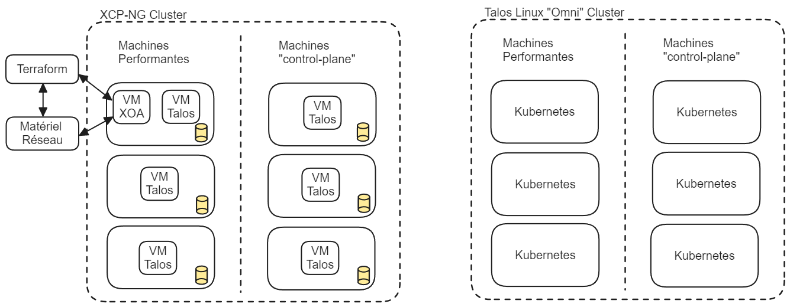

# CEDILLE Platform - LOG791 Report

date: 2023-12-18

## Introduction

As part of the LOG-791 course and our commitment within the Cedille club at the
École de Technologie Supérieure (ÉTS), we undertook the project of designing and
implementing the CEDILLE Platform. This report aims to comprehensively present
the various stages of our initiative, from its inception to its current
realization.

The main objective of the CEDILLE Platform project was to transform the existing
club infrastructure. We chose to implement a Kubernetes cluster on physical
servers, leveraging the capabilities of Talos OS and the Omni solution from
Sidero Labs. This approach was intended to be doubly beneficial: reducing
hosting costs while providing a concrete opportunity for learning and developing
skills in DevOps, Kubernetes, and server management.

Today, we are proud to note that most of the infrastructure and system services
are operational. However, it should be noted that some phases of the migration
of hosted services remain to be completed. This report aims to take stock of our
journey, highlighting both successes and challenges encountered, as well as
lessons learned from this experience.

In the following sections, we will detail the methodology adopted for the
realization of this project, as well as the stages of development and
implementation. We will highlight the technical and organizational challenges
encountered, as well as the solutions deployed to overcome them. We will also
shed light on the technological alternatives considered, to provide a
comprehensive view of our choices and decision-making process.

We will then analyze the results obtained, evaluating the success of the project
in relation to the initial objectives and deliverables. Particular focus will be
given to the learnings and skills developed throughout the project,
demonstrating the formative impact of this project on the entire team. Finally,
the conclusion will summarize our main achievements and propose recommendations
for future projects of a similar nature.

Through this report, we aim to provide you with an exhaustive overview of our
journey, highlighting our achievements as well as the key lessons learned during
this experience.

## Methodology

To successfully complete the CEDILLE Platform project, our team of students
adopted a practical and flexible approach, combining modern collaboration tools
and working methods adapted to our student context.

### Initial Planning and Project Vision

At the beginning of the project, we started with a detailed planning phase. For
this, we used a large board to visualize our entire technology stack and
understand how the different elements interacted with each other. This step was
crucial in helping us draft our vision document. This document served as a
roadmap for the entire project, clearly defining our objectives and approach.

### Work Organization and Backlog

Once our vision was established, we drew up a comprehensive list of all the
tasks to be completed in our backlog on GitHub. This allowed us to assess the
scope of the project and divide the work into three major iterations of one
month each. This iterative approach helped us stay focused and measure our
progress regularly.

### Retrospectives and Adjustments

After each iteration, we took the time to conduct a retrospective. These moments
were essential for reflecting on what went well and what we could improve for
the future. Thanks to these retrospectives, we were able to adjust our planning
and approach for the following iterations, learning from our previous
experiences.

### Documentation and Tracking on the Wiki

All our progress was carefully documented on our wiki. For each task or problem
encountered, we created an entry on the wiki with direct links to the
corresponding issues on GitHub. This allowed the entire team to easily track the
project's progress and quickly find relevant information related to each task.

### Meetings and Communication

Constant and effective communication was a cornerstone of our project. We
organized in-person work sessions every Sunday at the school for in-depth
collaboration and technical discussions. In addition, weekly meetings following
the Scrum model were held every Monday, allowing the team to discuss progress,
plan next steps, and resolve encountered obstacles.

### Adoption of Agile and DevOps Principles

Our collaboration process was strongly influenced by Agile and DevOps
principles. We adopted an iterative approach to development, allowing for quick
adaptation and responsiveness to changes. Continuous deployment and updates of
our architecture were managed through Infrastructure as Code (IaC), using CI/CD
pipelines to automate and streamline these processes. Additionally, the use of
templates for issues and pull requests on GitHub enhanced our efficiency and
maintained a standard of clarity and consistency in our communication and
development practices.

## Technical Architecture

### Kubernetes and Sidero Omni

For managing deployed applications, we chose to use container technology. This
allows for better isolation between different applications and easier dependency
management through Dockerfiles. To manage container deployments on our systems,
we chose to use Kubernetes as it is the industry standard and its coordination
capabilities are extremely powerful. Kubernetes allows for two types of nodes:
control plane and worker. In our case, we deployed 3 control planes and 3
workers. The 3 control planes allow the Kubernetes cluster itself to have high
availability (if one of the nodes is down or updated, there is no impact on the
cluster's capabilities). The 3 workers enable applications and storage to have
high availability.

Kubernetes is a system, but it is not precisely an operating system. Here, we
chose Talos OS: it is a Linux operating system entirely built around Kubernetes.
Most of the processes found in a standard Linux system are missing to reduce the
attack surface. Similarly, a significant portion of the file system is
read-only.

Another advantage of this operating system is that it can be fully controlled by
an API, allowing for better automation. The company that developed this OS also
developed a SaaS service that connects to this API and automates a significant
part of cluster management: Sidero Omni. As Sidero is a sponsor of the student
club, we have access to a license to use this typically paid software. This
allows us to easily manage the various servers remotely through a web interface.
Access control through the Kubernetes API also goes through this SaaS solution,
allowing for stricter access control with OAuth.

### GitOps Management

For managing deployments and configurations, we chose a fully GitOps approach.
This approach reduces the imperative and hard-to-reproduce steps to have easily
reproducible environments. Additionally, git's traceability allows for more
advanced change control flows and quicker identification of the source of
problems.

To achieve this GitOps objective, we used two tools: ArgoCD and Terraform.
ArgoCD is a Kubernetes-specific tool, deployed on the cluster. It monitors all
Kubernetes manifests in the Git repository and makes the necessary changes to
ensure the cluster is configured according to these manifests. This can include
configurations such as application deployments. The second tool, Terraform, is
mainly used to configure dependencies around Kubernetes. This tool allows for
defining cloud service configurations and linking variables between multiple
services, offering a very powerful cloud resource composition. Currently,
creating git repositories and configuring Google's KMS key management service
are the two main services configured with Terraform.

### Distributed Storage

To offer a quality service, it is important that services remain available even
in the event of failures or system updates. Kubernetes offers a way to
distribute application resources to achieve high availability. However, when
persistent data is involved, it is a bit more complex. Kubernetes leaves it to
administrators to define storage, providing only an abstraction. This allows for
a very flexible architecture (compatible with both physical and cloud
environments) but requires more work to configure. A simple solution is to use a
node's local storage to save data. However, with this solution, if the node
fails, the data becomes unavailable, and the application's availability is lost.
To avoid this situation, data must be distributed across different servers to
ensure at least 2 copies of each data are always on 2 different servers.

Several technologies allow for this, and we chose Mayastor. It is a storage
engine based on the NVMe-oF specification, a newer disk protocol than SCSI that
better leverages SSDs' parallelization capabilities. Mayastor is also fully
designed for and integrated with Kubernetes, reducing the risk of compatibility
issues that sometimes arise with engines initially designed for non-Kubernetes
systems.

Applications do not directly use Mayastor but rather Kubernetes abstractions:
StorageClass, PersistentVolumeClaim, and PersistentVolume. This would allow us
to change the storage engine in the future if necessary.

### Secret Management

Secret management is always a complex aspect where poor configuration can have
disastrous consequences. It is often through secret management that hackers
infiltrate systems. Here, we chose to use Hashicorp Vault, an industry standard
for large-scale secret management. To configure it, we deployed a
community-developed tool from RedHat: [Vault Config
Operator](https://github.com/redhat-cop/vault-config-operator/). This tool adds
Kubernetes manifest definitions (CRD), allowing us to create access policies,
key rotation configurations, and define new random secrets through Kubernetes
manifests that are then deployed by ArgoCD. This approach allows us to maintain
a GitOps approach without exposing secrets in files on Git.

### Observability

Observability is a cornerstone of any DevOps approach, allowing both developers
and administrators to quickly identify the source of a problem. In a distributed
system like the one we designed, traces are particularly important as they allow
us to follow a request's path through multiple systems.

To collect these traces, we used a tool called *Pixie*. This tool leverages a
relatively recent innovation in the Linux kernel: eBPF (extended Berkeley Packet
Filter). This allows applications to run certain operations in the privileged
context of the Linux kernel securely. This enables Pixie to analyze
communications between processes and the network and automatically recreate
traces without configuring each component to add its context to the trace.
Subsequently, these traces are exported to an OpenTelemetry agent. OpenTelemetry
is a standard for all things observability and facilitates the transfer of
traces, metrics, and logs between multiple systems. OpenTelemetry agents act as
exchangers, receiving and retransmitting traces, metrics, and logs. Here, we
redirect this information to the high-performance Clickhouse database. Finally,
we use Grafana to connect to this database and display all these traces,
metrics, and logs.

## Other Considered Solutions

During the analysis phase, we identified that some technical choices could be
made in several ways. Thus, in the vision document, we identified these options
and made an initial choice (Table 4.4.2). However, the implementation phase
allowed us to gain a better perspective on some choices and the possibility of
changing them. Therefore, we present these choices here:

### Storage Engine Choice

According to CAR8, we planned to use Rook-Ceph as the storage engine for
Kubernetes. As a reminder, the engine is responsible for providing a service
that responds to CSI requests in Kubernetes to allocate dedicated spaces to
pods, ensuring these spaces are accessible throughout the cluster and that data
is durable and integral.

Rook-Ceph is an extension of Ceph, a distributed storage system that predates
Kubernetes. In principle, it meets all our needs in terms of engine. However, in
practice, we found that the system was very unstable at our scale (3 servers).

After several attempts, we chose to replace Rook-Ceph with Mayastor, a system
designed from the beginning for Kubernetes. Ultimately, the deployment was
simpler, and the system is very stable.

### Secret Management Engine Choice

Given that our code repository is public and we use the GitOps approach, it is
imperative that no secrets are disclosed in the source code repository.
Therefore, we need a software solution that abstracts secrets to manage them
securely. So, the two main choices for this are Hashicorp Vault vs Bitnami
Sealed Secrets.

Bitnami Sealed Secrets: Secrets are still present in git but encrypted.
HashiCorp Vault: Secrets are not in Git, but their configurations and references
are. It also offers several advanced encryption modes, dynamic generation,
automatic rotation, and many other advanced features.

Thus, we determined that Vault would be a better solution for this project as we
consider it more secure (since no secret is publicly disclosed as in the case of
sealed-secrets) and that we would need the more advanced features it offers.

### Observability Platform Choice

According to CAR13, we chose to use the open technologies Pixie, OpenTelemetry,
and Clickhouse in a custom-built configuration for observability purposes. The
other choice was to use a commercial/all-in-one solution, such as Elastic or
Groundcover.

What influences our choice for this aspect is that an important consideration
for Cédille is to promote the use of open-source software. Thus, using
commercial solutions goes against this goal, and we try to avoid such choices
when possible. Additionally, we judged that building a custom solution by
combining these technologies (Pixie, OpenTelemetry, and Clickhouse) would have
greater value as a learning experience and result in a solution that better
meets our needs.

### Use of a Hypervisor

Before the analysis phase and drafting the vision document, we undertook a phase
of physical hardware installation and configuration. In this phase, we first
tried to use the XCP-NG hypervisor as the main operating system, with the plan
to configure our Kubernetes clusters with virtual machines.

To respect our goal of using declarative configurations as much as possible, we
had to manage the hypervisor, its network, and its storage exhaustively with
Terraform. Therefore, we were not ready to accept the level of complexity that
this method would have added, so we chose to install Talos Linux directly on the
machines without a hypervisor.

The final result is that most configurations and installations are done natively
in the Kubernetes cluster, offering a high level of consistency in the project's
code.

 **Figure:
Deployment Method Comparison**

## Challenges and Solutions

| Challenge                               | Problem                                    | Solution                                |
| --------------------------------------- | ------------------------------------------ | --------------------------------------- |
| Installation of Kubernetes/Talos        | Disk encryption not functional             | Disable encryption before installation  |
|                                         | Installation broken if USB key removed     | Reinstall with durable disk identifiers |
| ISO configuration in PVC for KubeVirt   | Need to simplify PVC management            | Use KubeVirt's CDI                      |
| Installation of Rook-Ceph               | Unusable Ceph cluster, OSD failures        | Manual disk wiping and operator restart |
| Stability of Rook/Ceph                  | Instability after node restart             | Replacement with Mayastor               |
| Configuration of a service mesh         | Issues with Linkerd and mTLS               | Choice of Kuma for mTLS and Gateway API support |
| Installation of External-DNS service    | Non-functional service, cause unknown      | Ongoing investigation, exploring alternative solutions |
| SSO configuration for ArgoCD            | Insecure secret management                 | Use Vault for secure secret management  |
| Bootstrapping Hashicorp Vault           | Complex manual process                     | Partial automation via Terraform and scripts |
| Deployment of Calidum-rotae             | Partial request routing                    | Direct configuration of a Discord webhook |
| Registration of VCluster in ArgoCD      | Difficulty in secure registration          | Use Crossplane for declarative registration |

## Results

Our project has seen significant progress, marked by a series of successfully
completed tasks, each contributing essentially to the overall advancement. Here
is a summary of the accomplished tasks, presented in chronological order of
their realization and by deliverable:

### Deliverable 1: Initial preparation and interviews phase. Initial deployment and configuration

- Preparation of specific questionnaires for each client and conducting
  interviews with various clubs and services at ÉTS, including AlgoETS,
  Raconteurs d'Angles, Saveurs de Génie, and IT services. These interviews
  helped define the project's success metrics.
- Setting up the physical cluster with Talos/Omni and basic configuration of
  Rook/Ceph. Evaluation of the networking stack for Kubernetes.
- Creation of a wiki to centralize documentation and drafting the initial vision
  document.
- Physical migration of servers to the server room and KubeVirt configuration.

### Deliverable 2: Advanced development and configuration

- Deployment of a sandbox cluster with Vcluster, installation and configuration
  of external-dns, Hashicorp Vault, and Crossplane on the cluster.
- Setup of Kustomize structure, ArgoCD configuration, Contour
  (reverse-proxy/ingress), and deployment of Kuma + Merbridge (service-mesh).
- Configuration and deployment of Grafana, Gateway API, and Mayastor.
- Thorough documentation of KubeVirt, Kuma, Merbridge, and Contour.

### Deliverable 3: Finalization and optimization

- Deployment of cert-manager, documentation of Mayastor, and local environment
  configuration with Omni.
- Setup of OTEL, monitoring Clickhouse with OpenTelemetry, and deployment of
  example applications like Grav and Calidum-Rotae.
- Update of architecture in README.md, removal of obsolete components
  (PostgreSQL database, phone number in protobuf), and instrumentation of the
  application with OTEL.

### Ongoing and Uncompleted Tasks

Although many tasks were successfully completed, some are still ongoing, notably
the deployment of cert-manager and the documentation of Vault. Additionally, the
integration of vclusters with ArgoCD is in progress.

In terms of uncompleted tasks, we decided not to pursue the
installation/configuration of k8s-sigs/external-dns in the cluster due to
project-specific constraints.

### Final Result

Our project led to the establishment of a deployment platform capable of
managing various services. This platform marks a significant improvement in how
we deploy, manage, and monitor IT services, offering a solution that meets the
diverse needs of each club.

For web applications, databases, or backend services, it provides the
flexibility and capabilities necessary for effective and secure deployment
management. With tools like ArgoCD and Kustomize, the deployment process is
automated, facilitating continuous updates and maintenance.

In observability and monitoring, the platform integrates OpenTelemetry, Grafana,
and Clickhouse, offering a comprehensive view of each deployed service's
performance and health. This monitoring capability is essential for quickly
identifying issues and optimizing performance.

Secret management is handled by implementing Hashicorp Vault, providing a
centralized and secure approach that enhances service security and simplifies
operational processes.

The platform also allows for creating isolated environments with Vcluster,
beneficial for developers from different clubs. They can test and develop in
separate environments without impacting the main infrastructure. This feature
promotes an anticipatory development approach, where testing and error detection
occur earlier in the development cycle.

HTTPS and ingress management are handled by Cert-Manager and Contour, providing
a secure configuration for service access. This combination ensures the
accessibility and security of deployed services, with automated management of
SSL/TLS certificates.

The following phases of our work and future initiatives will continue to build
on these foundations.

## Learnings and Skills Acquired

### Thomas

In the CEDILLE Platform project, I was responsible for configuring
OpenTelemetry, including the collector and operator, enriching my understanding
of system observability. Additionally, I used my Golang skills to integrate
traces into the Calidum-Rotae application, applying distributed tracing
principles to optimize monitoring and debugging. I also learned to use
Clickhouse for storing and analyzing OpenTelemetry collected data and Grafana
for their visualization. This combination of OpenTelemetry, Clickhouse, and
Grafana created a comprehensive monitoring ecosystem, allowing me to see how
these technologies interact and complement each other.

### Jonathan

Joining this project was my first experience in creating IT infrastructure.
Learning to configure and use the various services was one of the highlights for
me. I saw how each service contributes to the whole and how everything fits
together to create a functional system. This practical understanding provided me
with a solid foundation for estimating the effort required to deploy each
service and sizing the necessary resources, whether for a large-scale migration
or setting up a new infrastructure.

This project provided me with a reference model, not only for my future projects
but also for anyone interested in our work, as the entire project is publicly
accessible. It is an experience that will be useful to me far beyond this
project's scope.

Beyond the technical aspects, this project allowed me to see firsthand how
dividing work into iterations and planning based on feedback were key aspects
that enabled productive and continuous adaptability and responsiveness
throughout the iterations.

### Michael

With this project, I had the opportunity to learn how to use and design a good
project structure with Kustomize. Additionally, I learned how to use ArgoCD to
deploy applications according to the GitOps approach. I also collaborated with
my teammates on other aspects of the project, which was a good opportunity to
practice my communication and teamwork skills. The most valuable aspect of this
project is that we built an entirely new system as a team. Thus, we started with
an initial idea, discussed, analyzed, decided, architected, and implemented each
level of the system, which is an invaluable experience.

### Simon

Before starting this project, I already had superficial experience with several
of these tools. However, this was the first time I had the opportunity to
explore these technologies more in-depth, which I believe will shape the future
of large-scale enterprise operations. Notably regarding secret and storage
management, I believe we configured the tools in a very interesting way that
would work well for thousands of servers.

But above all, I learned a lot about teamwork and work organization. This
project had few fixed objectives, and it was necessary to implement certain
measures to achieve the required rigor to advance the project at a satisfactory
pace. Setting up strong task tracking, pull request processes, regular work
workshops, and more were essential to the project's success.

## Conclusion

In retrospect, the CEDILLE Platform project has been a formative experience,
rich in technical and project management lessons. We took on the challenge of
designing and implementing a complex IT infrastructure, requiring meticulous
coordination and close collaboration between team members.

One of the key lessons learned from this project is the need to better
prioritize our work backlog. In hindsight, we realized that some operations were
blocking and should have been prioritized. For example, the configuration of
Vault, a key component for secret management, could have been done earlier as
several other services depended on its setup. This realization will be crucial
for the efficiency of our future projects.

With the infrastructure mainly in place, our next step is to plan and execute
the migration of existing services. This phase requires meticulous management to
ensure a smooth transition, focusing on minimizing service interruptions and
optimizing performance and security.

For future projects, our advice would be to value adaptability and the ability
to respond to unforeseen changes. Flexibility in planning and the willingness to
revise strategies in the face of new information were key factors in the
project's success.

In summary, this project has been an enriching experience that exceeded our
expectations in terms of learning and professional development. We are excited
to apply these acquired skills and knowledge in the following phases of our work
and future initiatives.

## Appendices

- [Vision Document](../vision.md)
- [Sprints](index.md)
- [Git Repository](https://github.com/ClubCedille/Plateforme-Cedille)
- [Task Tracking](https://github.com/orgs/ClubCedille/projects/3)
