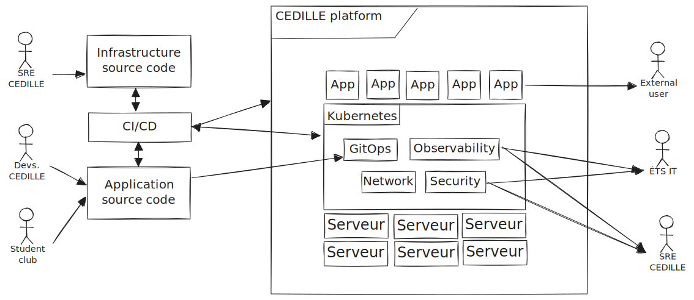

# CEDILLE Platform - Vision Document

**Organization:** CEDILLE, École de Technologie Supérieure

This overview provides a clear view of the 'why' and 'what' of our new CEDILLE
platform project. Here, we dive into the rationale behind our Kubernetes-based
platform, powered by SideroLabs' Omni SaaS, detailing why we embarked on this
journey and how we believe it will transform how we manage our hosting services
on our bare-metal servers.

## 1. Overview

### 1.1 Problem Statement

The CEDILLE club is responsible for hosting and supporting the development of a
significant number of websites and web services for the student clubs at ÉTS.
Additionally, the club aims to provide its members with learning opportunities
in DevOps, Kubernetes, and server management technologies.

Currently, the services are deployed on a Kubernetes platform hosted by Google
Cloud (GKE). However, this platform incurs significant costs, and the increasing
number of hosted clubs makes maintaining this platform financially challenging.
Moreover, the structure of maintenance and deployment operations is currently
too complex to ensure an interesting learning curve for club members.

Also, the current solution does not offer enough flexibility and control to
allow members to experiment with the technologies used. Finally, ÉTS is in the
process of reviewing its security practices following new government guidelines,
so CÉDILLE must rework its infrastructure to meet the new requirements.

### 1.2 Objective

Due to the mentioned problems and new requirements, the CEDILLE club recently
purchased physical servers and installed Kubernetes on them. The decision was
made to take this opportunity to review the entire infrastructure and DevOps
systems to better meet the needs of the club, its clients, and ÉTS.

To achieve this, we will deploy various automation, observability, and
redundancy systems. The goal is to make the experience of CÉDILLE clients more
fluid and consistent. Additionally, we aim to clarify the development and
maintenance process for CEDILLE club members themselves. Whenever possible,
open-source and cloud-native software will be favored to respect the philosophy
of the CEDILLE student club.

### 1.3 Scope

This solution must be comprehensive to cover different use cases while meeting
the security requirements requested by ÉTS. However, it is important to delimit
what is part of the project and what is not at this stage:

#### Included

- All definitions of infrastructure and network topology
- Redundancy systems
- Observability systems
- Environment management (pre-production, production, etc.)
- Deployment management, including progressive (blue-green, canary...)
- Security systems
- Test and deployment pipelines (CI/CD)

#### Excluded

- Configuration of development environments for developers
- Programming the websites that will be on the infrastructure
- Complete service migration (some services as proof of concept by the end of
  this project, others after the end of this project)

### 1.3 Definitions and Acronyms

#### Table 1.3.1: Definitions and Acronyms

| **Acronym**               | Definition                                                                                                                                                                                                                                                                                                                                                                                                                                                |
| ------------------------- | --------------------------------------------------------------------------------------------------------------------------------------------------------------------------------------------------------------------------------------------------------------------------------------------------------------------------------------------------------------------------------------------------------------------------------------------------------- |
| **ÉTS**                   | École de Technologie Supérieure                                                                                                                                                                                                                                                                                                                                                                                                                           |
| **Docker**                | A container is a standard software unit that packages code and all its dependencies so the application runs quickly and reliably from one computing environment to another. A Docker container image is a lightweight, standalone, and executable package that includes everything needed to run an application: code, runtime, system tools, system libraries, and settings.                                                                             |
| **Kubernetes**            | An open-source system for automating the deployment, scaling, and management of containerized applications.                                                                                                                                                                                                                                                                                                                                               |
| **Cluster**               | In a computing system, a cluster is a group of servers and other resources that act as a single system and enable high availability, load balancing, and parallel processing. These systems can range from a two-node system of two personal computers (PCs) to a supercomputer with a cluster architecture.                                                                                                                                              |
| **Namespace**             | In Kubernetes, namespaces provide a mechanism for isolating groups of resources within a single cluster. Resource names must be unique within a namespace but not across namespaces. Namespace-based scope applies only to namespace-scoped objects (e.g., deployments, services, etc.) and not to cluster-scoped objects.                                                                                                                                |
| **vCluster**              | Virtual Kubernetes clusters running in standard namespaces                                                                                                                                                                                                                                                                                                                                                                                                |
| **Load balancer**         | Load balancing refers to efficiently distributing incoming network traffic across a group of backend servers, also known as a server farm or server pool.                                                                                                                                                                                                                                                                                                 |
| **MetalLB**               | MetalLB is a load balancer implementation for on-premises Kubernetes clusters using standard routing protocols.                                                                                                                                                                                                                                                                                                                                           |
| **KubeVirt**              | Extension for Kubernetes that allows managing and running virtual machines alongside containers.                                                                                                                                                                                                                                                                                                                                                          |
| **Mikrotik**              | Mikrotik is an enterprise network equipment provider at a reasonable price.                                                                                                                                                                                                                                                                                                                                                                               |
| **Clickhouse**            | Clickhouse is a high-performance database for large-scale data.                                                                                                                                                                                                                                                                                                                                                                                           |
| **Logs**                  | Logs are purely textual information coming from a software service.                                                                                                                                                                                                                                                                                                                                                                                       |
| **Traces**                | Traces are detailed information about the internal operations of a software service, such as the response time of an SQL query.                                                                                                                                                                                                                                                                                                                           |
| **Metrics**               | Metrics are usually formatted as time series information that measures statistics.                                                                                                                                                                                                                                                                                                                                                                        |
| **OTEL (OpenTelemetry)**  | OpenTelemetry is an open-source project that defines standard protocols and methods for collecting and transferring Logs, Traces, and Metrics.                                                                                                                                                                                                                                                                                                            |
| **BGP**                   | Border Gateway Protocol (BGP) refers to a gateway protocol that enables the internet to exchange routing information between autonomous systems (AS).                                                                                                                                                                                                                                                                                                     |
| **Talos Linux**           | Kubernetes distribution provided by Sidero Labs                                                                                                                                                                                                                                                                                                                                                                                                           |
| **Contour**               | Contour is an open-source Kubernetes ingress controller providing the control plane for Envoy Edge and service proxy. Contour supports dynamic configuration updates and multi-team ingress delegation out of the box while maintaining a lightweight profile.                                                                                                                                                                                            |
| **Ingress**               | In Kubernetes, an Ingress is an object that manages external access to services in a cluster, typically via HTTP.                                                                                                                                                                                                                                                                                                                                         |
| **Egress**                | Outbound traffic from a network or pod in a Kubernetes context.                                                                                                                                                                                                                                                                                                                                                                                           |
| **Linkerd**               | A lightweight and secure service mesh for Kubernetes that provides features such as traffic routing, telemetry, and mTLS security.                                                                                                                                                                                                                                                                                                                        |
| **Service mesh**          | A dedicated infrastructure layer for facilitating service-oriented communications, offering features such as service discovery, load balancing, telemetry, and service authentication.                                                                                                                                                                                                                                                                    |
| **Terraform**             | Terraform is a tool that enables infrastructure as code (IaC).                                                                                                                                                                                                                                                                                                                                                                                            |
| **Rook/Ceph**             | Rook is an orchestration of storage for Kubernetes, and Ceph is a distributed storage system that Rook can orchestrate.                                                                                                                                                                                                                                                                                                                                   |
| **Kube-score**            | Kube-score is a tool for Kubernetes that recommends changes to improve security and reliability.                                                                                                                                                                                                                                                                                                                                                          |
| **CI**                    | Continuous Integration                                                                                                                                                                                                                                                                                                                                                                                                                                    |
| **CD**                    | Continuous Deployment                                                                                                                                                                                                                                                                                                                                                                                                                                     |
| **Github Action**         | Github Action is the tool for CI/CD for the GitHub platform.                                                                                                                                                                                                                                                                                                                                                                                              |
| **Gitops**                | A method for managing and updating infrastructures and applications using Git tools. With GitOps, Git serves as the single source of truth for code and infrastructure.                                                                                                                                                                                                                                                                                   |
| **ArgoCD**                | A declarative, GitOps continuous delivery tool for Kubernetes.                                                                                                                                                                                                                                                                                                                                                                                            |
| **Canary Deployment**     | A deployment strategy that involves deploying a new version of an application alongside the existing version but directing only a small portion of traffic to the new version. If everything goes well, the traffic is gradually increased until the new version takes all the traffic.                                                                                                                                                                   |
| **Blue-Green Deployment** | A deployment strategy where two versions of the application are maintained side by side (blue for the current, green for the new). Once the new version (green) is ready and tested, the traffic routing is switched from the blue version to the green version. This allows for updates without downtime.                                                                                                                                                |
| **Argo Rollouts**         | An extension of Argo that provides advanced deployment features such as Canary and Blue-Green.                                                                                                                                                                                                                                                                                                                                                            |
| **Kustomize**             | A customization tool for Kubernetes manifests, allowing the definition of variants from a base configuration.                                                                                                                                                                                                                                                                                                                                             |
| **Odo**                   | Odo is a fast development tool for Kubernetes and OpenShift applications, simplifying the DevOps cycle.                                                                                                                                                                                                                                                                                                                                                   |
| **Github registry**       | A software package hosting service linked to GitHub.                                                                                                                                                                                                                                                                                                                                                                                                      |
| **Grafana**               | An open-source platform for monitoring and alerting. Typically used in tandem with Prometheus for monitoring Kubernetes clusters.                                                                                                                                                                                                                                                                                                                         |
| **Pixie**                 | A native observability tool for Kubernetes, allowing diagnosing applications without instrumentation code.                                                                                                                                                                                                                                                                                                                                                |
| **Oneuptime**             | OneUptime is a comprehensive solution for tracking and managing your online services. Whether you need to monitor your website's uptime, dashboard, API, or any other online resource, OneUptime can alert your team in case of downtime and keep your customers informed with a status page. OneUptime also helps you manage incidents, configure on-call rotations, run tests, secure your services, analyze logs, track performance, and debug errors. |
| **Trivy**                 | A simple and comprehensive container vulnerability                                                                                                                                                                                                                                                                                                                                                                                                        |

scanner. | | **Cosign** | A tool for signing and verifying container image
signatures. | | **CodeQL** | A source code analysis platform to find
vulnerabilities in the code. Owned by GitHub. | | **Hashicorp Vault** | A tool
for managing secrets and protecting sensitive data. | | **Kubescape** | A tool
for analyzing Kubernetes cluster compliance and security. | | **SonarQube** | A
continuous code quality analysis platform that inspects code for bugs, code
smells, and security vulnerabilities. |

## 2. Product Position

### 2.1 Problem Statement

The CEDILLE club takes on the task of hosting and supporting the development of
numerous websites and online services for the student associations at ÉTS.
Furthermore, the club aims to provide its members with opportunities to acquire
skills in DevOps, Kubernetes, and server management.

Currently, our infrastructure relies on a Kubernetes cluster managed by Google
Cloud (GKE). However, the costs associated with this platform are high, and with
the increasing number of clubs we support, the costs are becoming financially
problematic. Additionally, the largely automated management by Google Cloud
limits our flexibility to customize our hosting solutions and restricts learning
opportunities for our members.

#### Table 2.1.1: Problem Statement

| Statement                       |                                                                                                                                                                                                                                                                                                                                                                                                                                                                                                               |
| ------------------------------- | ------------------------------------------------------------------------------------------------------------------------------------------------------------------------------------------------------------------------------------------------------------------------------------------------------------------------------------------------------------------------------------------------------------------------------------------------------------------------------------------------------------- |
| The problem                     | 1. Financial Constraint: The cost of maintaining services on Google Cloud is significantly high and becomes increasingly difficult to manage as the number of hosted student clubs increases. \n 2. Limited Learning and Customization: The management of most operations by Google Cloud results in a restricted environment that offers few opportunities to learn and customize hosting solutions, especially in the fields of DevOps, Kubernetes, and server management.                               |
| affects                         | 1. Financial Sustainability: The club faces a growing financial burden that could threaten its ability to continue offering hosting services to student clubs. \n 2. Educational Value: The current configuration limits the learning experiences of club members, particularly in relevant areas for their technical growth such as DevOps, Kubernetes, and server management.                                                                                                                            |
| and this impacts the outcome by | 1. Financial Strain: If the situation remains unchanged, the CEDILLE club risks becoming financially unsustainable, which could result in the discontinuation of hosting services for many student clubs, thus affecting their online presence and operations. \n 2. Reduced Technical Skills Development: Club members miss out on practical experiences and valuable skills development, which is one of the club's key objectives to enhance the employability and technical expertise of its members. |

### 2.2 Product Statement

The club has decided to migrate the servers to physical servers, which will be
deployed at ÉTS. The product named **Plateforme CEDILLE** is a hosting
infrastructure based on physical servers, deployed at ÉTS, and managed via a
Sidero Labs Omni license. This platform aims to provide a sustainable and
scalable solution for hosting student clubs' websites and other services. The
platform uses a GitOps architecture, integrating various automation, monitoring,
and security tools to simplify management while maintaining a high level of
performance and security.

#### Table 2.2.1: Product Statement

| Statement             |                                                                                                                                                                                                                                                                                         |
| --------------------- | --------------------------------------------------------------------------------------------------------------------------------------------------------------------------------------------------------------------------------------------------------------------------------------- |
| Plateforme CEDILLE is | A local hosting infrastructure on physical servers, designed to reduce costs while providing a flexible and educational environment for CEDILLE club members.                                                                                                                           |
| which                 | Enables better cost control and offers richer opportunities for learning and skill development in DevOps, Kubernetes, and server management. It also facilitates monitoring, security, and automation, while being flexible enough to meet the specific needs of various student clubs. |
| Unlike                | The former Google Cloud (GKE) based infrastructure, which incurred high costs and offered fewer opportunities for learning and customization due to centralized management by Google Cloud.                                                                                             |
| This product          | Significantly reduces the club's financial burden while enhancing the educational value and practical experience for members. It provides a more sustainable and customizable solution for the hosting needs of ÉTS student clubs.                                                      |

## 3. User and Stakeholders

### 3.1 Stakeholders Summary

Stakeholders are all the individuals or entities with an interest in the project
outcome.

#### Table 3.1.1: Stakeholders Summary

| **Name**                                | **Description**                                                          | **Responsibilities**                                                                                                                       |
| --------------------------------------- | ------------------------------------------------------------------------ | ------------------------------------------------------------------------------------------------------------------------------------------ |
| **S1** The CEDILLE club and its members | Open-Source student club at École de Technologie Supérieure              | Design, implementation, and maintenance of the CEDILLE platform.                                                                           |
| **S2** ÉTS Clubs Administration         | Organization within ÉTS that handles the administration of student clubs | Ensure that all implemented services serve the student clubs and comply with regulations.                                                  |
| **S3** ÉTS IT Department (TI)           | Organization within ÉTS that handles IT services                         | Ensure that all our services are secure and do not violate any rules.                                                                      |
| **S4** ÉTS Student Clubs                | Student clubs at École de Technologie Supérieure                         | Clubs must clearly communicate their needs and requirements and provide feedback on the services and features offered by the new platform. |

### 3.2 Users Summary

Users are all the individuals or entities that will use this product.

#### Table 3.2.1: Users Summary

| **Name**                               | **Description**                                                                                                           | **Responsibilities**                                                                     |
| -------------------------------------- | ------------------------------------------------------------------------------------------------------------------------- | ---------------------------------------------------------------------------------------- |
| **U1** Platform Administrator          | Platform administrator designated by the CEDILLE club                                                                     | Platform maintenance and approval of new deployments.                                    |
| **U2** Student clubs and their members | Student clubs at École de Technologie Supérieure                                                                          | Interact with the platform to obtain various information about their different services. |
| **U3** ÉTS Staff                       | Student clubs administration and IT services of ÉTS                                                                       | Ensure the compliance of applications and infrastructure.                                |
| **U4** Application Developers          | Sometimes members of CEDILLE, sometimes from other clubs, responsible for the programming of the software on the servers. ||

### 3.3 User Environment

**(U1)** Platform administrators can log in to the CEDILLE Platform via a web
interface or command-line tools to manage various services. The ÉTS IT
Department **(S3)** ensures that the connectivity and security of the services
are maintained, while adhering to the regulations and standards in place.

**(U2)** Student clubs and their members interact with the CEDILLE Platform via
web portals and applications to access information, services, and various
resources. They must also communicate their needs and requirements via the
Discord server.

The regulation of the clubs is supervised by the ÉTS Clubs Administration
**(S2)**, which ensures that the CEDILLE Platform serves the interests of the
student clubs and complies with institutional regulations.

**(S4)** The ÉTS student clubs play an active role as providers of requirements
and feedback. They are the end-users of the services and thus have a key role in
ensuring that the CEDILLE Platform meets their needs and expectations.

The entire CEDILLE Platform and related services must comply with DevOps
standards and best practices as defined in the section
[Normes et standards](#71-standards-and-norms).

All parties must adhere to the standards and protocols in place to ensure the
security, performance, and availability of the CEDILLE Platform. These standards
are defined and maintained by the CEDILLE club **(S1)** and the ÉTS IT
Department **(S3)**.

## 3.4 Key User Needs

The needs are determined from a series of interviews and meetings with
stakeholders. Reports of these interviews and meetings are available in Appendix
1 of this document.

Additionally, the administration needs are largely determined by the authors of
this document, as they will also be responsible for the administration of the
platform to be implemented.

### Table 3.4.1: Priority Definition

| **Priority** | **Definition**                                                                                                            |
| ------------ | ------------------------------------------------------------------------------------------------------------------------- |
| Critical     | This need is essential to the success of the project. If unmet, the project would be non-functional.                      |
| Important    | Meeting this need provides substantial value to the project; if unmet, there will be a negative impact on the experience. |
| Optional     | If this need is not met, the experience will remain positive, albeit reduced.                                             |

#### Table 3.4.1: Key User Needs

| **ID**  | **Priority** | **Need**                                                                                                                                                                                                                                           |
| ------- | ------------ | -------------------------------------------------------------------------------------------------------------------------------------------------------------------------------------------------------------------------------------------------- |
| **B01** | Critical     | The platform management by administrators (U1) must be accessible at different levels of knowledge: beginners should be able to manage the platform for basic deployments and have a clear learning path through the platform to become an expert. |
| **B02** | Critical     | Student clubs' websites (U2) must be publicly accessible on the internet.                                                                                                                                                                          |
| **B03** | Critical     | All public club services (U2) must use HTTPS.                                                                                                                                                                                                      |
| **B04** | Important    | Clubs (U2) should be able to make minor changes to websites themselves.                                                                                                                                                                            |
| **B05** | Critical     | Automation processes should allow changes to club applications (U2) in less than 3 days, including the review and approval process.                                                                                                                |
| **B06** | Critical     | Observability processes should notify administrators (U1) of any issues with a club's application (U2).                                                                                                                                            |
| **B07** | Important    ||

| Observability processes should notify student club captains (U2) in case of
incidents. | | **B08** | Optional | Clubs (U2) should have access to
observability dashboards for their applications. | | **B09** | Critical |
Systems must be highly available so that updates and server issues do not cause
unavailability. | | **B10** | Important | There should be post-incident
reporting processes for clubs (U2) during availability incidents and for ÉTS
(U3) during security incidents. | | **B11** | Critical | Clubs' databases (U2)
and administration (U1) must be restorable in case of data corruption or
critical events. | | **B12** | Important | User/club-oriented documentation (U2)
should describe how the tools and processes work. | | **B13** | Critical | Each
deployed image must always have security patches applied. ÉTS IT services (U3)
must be able to verify this. | | **B14** | Critical | ÉTS staff (U3) must be
able to validate which applications are deployed on the servers and which are
public. | | **B15** | Optional | ÉTS staff (U3) should be notified during the
deployment of a new application and must approve the request. | | **B16** |
Critical | ÉTS IT services (U3) and platform administrators (U1) must be able to
trace and revert any changes made to the platform. | | **B17** | Important |
Administrators (U1) and developers (U4) must have access to "sandbox"
environments to test new applications and projects. | | **B18** | Important |
Developers (U4) must be able to test their applications in an environment
similar to production before making an update or a new deployment. | | **B19** |
Critical | Administrators (U1), ÉTS staff (U3), and application developers (U4)
must have access to logs, traces, and metrics as applicable. | | **B20** |
Critical | Platform management for an administrator (U1) must be documented in
detail. | | **B21** | Critical | Testing and deployment of new code written by
developers (U4) must be automated to reduce dependency on administrators (U1). |
| **B22** | Important | Unit testing systems should be in place for new code
written by developers (U4). | | **B23** | Optional | Code quality testing
systems should be in place for new code written by developers (U4). | | **B24**
| Important | Kubernetes configuration validation systems should be in place to
prevent configuration errors by administrators (U4). | | **B25** | Important |
Scanning systems should detect code that introduces security risks. | | **B26**
| Critical | Secrets managed by administrators (U4) must be protected and
encrypted to prevent unauthorized access. | | **B27** | Critical | Updates
should be automated or semi-automated to keep applications and dependencies up
to date. | | **B28** | Optional | Deployments should be progressive, giving
developers (U4) the ability to roll back in case of an increased error rate. |

## 4. Product Presentation

The product is a system that will enable the deployment and hosting of Web
applications and other services for the student clubs at ÉTS. The goal is for
the system architecture to follow the DevOps philosophy at every implementation
layer.

### 4.1 Product Context

**Figure 4.1.1:** Product Context

### 4.2 Assumptions and Dependencies

This section lists the assumptions and dependencies that are essential for the
development and deployment of the CEDILLE Platform.

#### Assumptions

- Hardware Availability: We assume that all necessary servers and hardware
  equipment will be available in a timely manner and meet the required
  configuration specifications.
- Technical Expertise: The assumption is made that club members have or will
  acquire the necessary skills in DevOps technologies, Kubernetes, and server
  management.
- Institutional Support: We assume that ÉTS will provide ongoing support for the
  project, including space for servers and access to network resources.

#### Dependencies

- Operating System: Our platform depends on the Talos Linux operating system
  compatible with Kubernetes.
- Kubernetes: The proper functioning of the platform relies on the latest stable
  version of Kubernetes.
- Monitoring Tools: The platform depends on monitoring solutions such as Pixie,
  OpenTelemetry, ClickHouse, and Grafana for tracking performance and system
  health.

### 4.3 License

Given that the CEDILLE club has an educational dimension and aims to teach
DevOps, Kubernetes, and server management technologies, the choice of a license
that promotes flexibility, accessibility, and collaboration is crucial. This is
why we opted for the
[Apache 2.0 license](https://github.com/ClubCedille/Plateforme-Cedille/blob/master/LICENSE)
for our infrastructure.

### 4.4 Product Features

#### Table 4.4.1: Priority Definition

| **Priority** | **Definition**                                                                          |
| ------------ | --------------------------------------------------------------------------------------- |
| Urgent       | This feature is necessary for the implementation of many other features.                |
| Important    | This feature blocks some other features.                                                |
| Necessary    | This feature does not block anything but must be implemented for the project's success. |
| Optional     | This feature adds value but is not necessary for the project's success.                 |

#### Table 4.4.2: Product Characteristics

| **ID** | **Priority** | **Corresponding Needs** | **Description**                                                                                                                                                                                                                                                     |
| ------ | ------------ | ----------------------- | ------------------------------------------------------------------------------------------------------------------------------------------------------------------------------------------------------------------------------------------------------------------- |
| CAR1   | Urgent       | B09                     | 6 servers (3 control planes, 3 workers) will be deployed to achieve high availability for management and applications.                                                                                                                                              |
| CAR2   | Urgent       | B13, B26                | The servers will use the minimal operating system "Talos OS" to reduce the attack surface and facilitate the management and updates of the operating system via a secure web API.                                                                                   |
| CAR3   | Necessary    | B01, B16                | The infrastructure will be defined _as code_ using Terraform. This includes the configuration of network hardware as well as the servers themselves.                                                                                                                |
| CAR4   | Important    | B02, B03                | The servers and the router will use BGP (MetalLB on Kubernetes) for load balancing between servers.                                                                                                                                                                 |
| CAR5   | Urgent       | B18                     | Multiple environments will be logically separated using vCluster to create virtual Kubernetes environments for production, development, and others.                                                                                                                 |
| CAR6   | Urgent       | B03                     | The Contour _reverse-proxy/ingress_ program will be installed and configured to route HTTP requests and configure HTTPS certificates. This ingress system is lightweight and easy to configure.                                                                     |
| CAR7   | Necessary    | B28                     | The _Linkerd_ service mesh program will be used to securely connect applications to each other and manage progressive deployments.                                                                                                                                  |
| CAR8   | Urgent       | B11                     | The server disks will be managed by Rook/Ceph with data replication to reduce the risk of data loss and instability periods.                                                                                                                                        |
| CAR9   | Important    | B11                     | The data stored on Rook/Ceph will be regularly backed up to Google Cloud to ensure data recovery in case of a catastrophic event.                                                                                                                                   |
| CAR10  | Necessary    | B13, B14, B25           | Communications between services will be defined via NetworkPolicies to reduce the risk of attacks through a compromised component.                                                                                                                                  |
| CAR11  | Important    | B18                     | _Kubevirt_ will be installed and configured to allow the deployment of virtual machines when containerization is difficult or impossible.                                                                                                                           |
| CAR12  | Important    | B06, B07, B08           | An observability platform based on OpenTelemetry, Clickhouse, and Grafana will be set up to quickly identify the source of problems.                                                                                                                                |
| CAR13  | Important    | B06, B19                | Pixie and OpenTelemetry instrumentation tools will be used to collect logs, traces, and metrics from Kubernetes and applications.                                                                                                                                   |
| CAR14  | Important    | B21                     | GitHub Actions will be used to run integration pipelines.                                                                                                                                                                                                           |
| CAR15  | Important    | B13                     | The GitHub Registry will be used to store container images.                                                                                                                                                                                                         |
| CAR16  | Urgent       | B05, B16                | ArgoCD will be used as a GitOps solution for application deployment management. This tool is _self-correcting_, meaning that any discrepancy between the current state and the configurations on git will be automatically corrected.                               |
| CAR17  | Necessary    | B27                     | Use Dependabot to open PRs for software updates or automatically update in the case of applications in a CÉDILLE directory.                                                                                                                                         |
| CAR18  | Important    | B21                     | Kustomize will be used to manage sets of Kubernetes manifests for each deployed application. It will also allow defining _layers_ for production and development.                                                                                                   |
| CAR18  | Important    | B28                     | Set up a pipeline for progressive deployments (_Exact technologies to be defined_).                                                                                                                                                                                 |
| CAR19  | Necessary    | B22, B24                | Kube-Score (best practices/errors) and Kubescape (security) will be used to automatically review and test changes to Kubernetes manifests.                                                                                                                          |
| CAR20  | Optional     | B18                     | ODO (Red Hat) will be used to automatically build images for projects without a Containerfile/Dockerfile and facilitate development.                                                                                                                                |
| CAR21  | Urgent       | B26                     | Hashicorp Vault will be deployed and used for secret management. Google KMS will be used for Vault decryption.                                                                                                                                                      |
| CAR22  | Necessary    | B13, B25                | Trivy and Cosign will be used to test image security and sign them before publication.                                                                                                                                                                              |
| CAR23  | Necessary    | B25                     | GitHub Advanced Security, with CodeQL, will be used to find security errors in the code of applications managed by CÉDILLE.                                                                                                                                         |
| CAR24  | Necessary    | B08, B12, B19           | Integration of an analytical dashboard to help clubs understand the usage and performance of their applications.                                                                                                                                                    |
| CAR25  | Necessary    | B05, B16                | Set up a complete audit log to track all changes and operations performed on the platform.                                                                                                                                                                          |
| CAR26  | Urgent       | B12, B20                | Provide an integrated wiki with tutorials, guides, and FAQs for platform administrators and users.                                                                                                                                                                  |
| CAR27  | Important    | B17, B18                | Integration of simulation tools to help developers test their applications in an environment similar to production.                                                                                                                                                 |
| CAR28  | Important    | B04, B05, B21           | Self-deployment capability for clubs, through good documentation and pipelines allowing autonomous updates without constant dependency on administrators.                                                                                                           |
| CAR29  | Important    | B12, B21, B22, B15      | Integration of pull request (PR) templates to standardize and streamline the code submission process. This will help ensure that each PR is well-documented and meets club standards before merging. Notify and include ÉTS staff when deploying a new application. |
| CAR30  | Necessary    | B12, B21                | Use "Code Owners" to specify responsible parties for different parts of the code. This will ensure that the right people are notified for each PR review.                                                                                                           |
| CAR31  | Necessary    | B12, B20, B21           | Set up contribution guides to help new members or contributors understand how to contribute correctly to the project.                                                                                                                                               |
| CAR32  | Necessary    | B12, B21                | Use "Issue Templates" to standardize the way issues or features are reported, facilitating their management and tracking.                                                                                                                                           |
| CAR33  | Important    | B21, B22, B23           | Set up _pre-commit-hooks_ to automatically check linting or other verifications at each commit.                                                                                                                                                                     |
| CAR34  | Necessary    | B05                     | Environments should be created during Pull Requests to allow testers to validate changes before accepting them.                                                                                                                                                     |
| CAR35  | Necessary    | B10                     | Document a post-incident process, including report templates. Define the communication process to the clubs.                                                                                                                                                        |
| CAR36  | Necessary    | B01                     | Set up a repository template using github-safe-settings to automate the standards and rules of a project according to the applied framework.                                                                                                                        |

### 5. Constraints

#### Table 5.1: Constraints

| **ID** | **Constraints**                                                | **Description**                                                                                                                                                                                                                                                                                                                                                                         |
| ------ | -------------------------------------------------------------- | --------------------------------------------------------------------------------------------------------------------------------------------------------------------------------------------------------------------------------------------------------------------------------------------------------------------------------------------------------------------------------------- |
| C01    | Prohibition of storing personal data.                          | Due to ÉTS data protection policies, it was deemed less risky for the project to never store personal data on the CEDILLE platform.                                                                                                                                                                                                                                                     |
| C02    | Allow full visibility of our infrastructure to the IT services | The IT services must have the ability to monitor and inspect all services and applications deployed on the CÉDILLE platform to ensure they strictly meet the needs of the clubs and that no unrelated services, such as those used for other commercial activities, are hosted. This requirement stems from past issues with unrelated services being deployed on the school's network. |
| C03    | Network access control shared with the school's IT service     | Although we control internal network routing and management through our router, external access and certain network features are strictly controlled and managed by the ÉTS IT services. Any request for access or modification of external access control must be coordinated and approved by them.                                                                                    |

### 6. Quality Attributes

#### Interoperability

AQ1 - The system must easily integrate with third-party tools such as
observability services.

#### Performance

AQ2 – The performance of club applications must be sufficient according to the
needs of each application.

#### Modifiability

AQ3 – Any element of the system must be easily modifiable, preferably through
source code.

#### Security

AQ4 – Data confidentiality must be maintained at all times.

AQ5 – System configuration is only modifiable by authorized parties.

AQ6 – Secrets are encrypted at rest and not exposed publicly.

#### Usability

AQ6 – Each layer of the system must be documented.

AQ7 – The system must be understandable to all members of the CEDILLE club (new
and old).

#### Scalability

AQ8 – The system should handle scaling applications according to performance
needs.

## 7. Other Requirements

### 7.1 Standards and Norms

- We aim to use the [ISO 32675:2022](https://www.iso.org/standard/83670.html)
  standard as a guideline for our infrastructure.

### 7.2 Documentation Requirements

- Technical Architecture: Diagrams and detailed explanations of the server,
  network, and technology stack architecture.
- Configuration Documentation: Instructions for setting up and configuring the
  environment, including physical servers, Kubernetes, and all other tools used.
- User Manual: Documentation for club members and other platform users,
  explaining how to deploy and manage their services.
- Backup and Recovery Procedures: Protocols to follow in case of system failure
  or other emergencies.
