# 🖥️ Git dans Visual Studio Code : une interface conviviale pour débutants

Bien que la **CLI Git** soit puissante, elle peut sembler intimidante pour les débutants.
Visual Studio Code (VSCode) propose une **extension Git intégrée** qui simplifie la plupart des opérations Git avec un flux visuel épuré.

Ce guide montre comment effectuer les opérations Git essentielles dans VSCode et comment il se compare à la ligne de commande.

---

## 📄 Statut des fichiers et barre latérale Git

- Cliquez sur l’**icône Contrôle de source** dans la barre latérale gauche.
- VSCode affiche :
  - Fichiers modifiés
  - Modifications mises en scène
  - Fichiers non suivis
  - Conflits (avec marqueurs)

> ✅ Vous pouvez **"stage"** les fichiers d’un simple clic ➕, et **annuler** les modifications avec l’icône poubelle.

---

## ✅ Valider les modifications

**CLI:**

``` bash
git add .
git commit -m "Your message"
```

VSCode:

Vous pouvez tous les "stage" avec le signe + ou appuyer sur le bouton de validation.

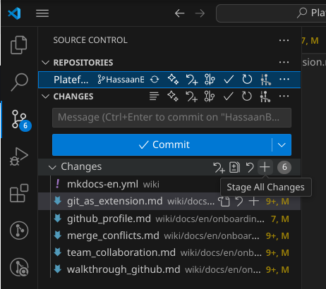

> 💡  VSCode met également en évidence les changements ligne par ligne, vous permettant de valider des morceaux de fichiers (« hunks ») individuellement.

## 🚀 Pousser vers GitHub

CLI:

```bash
git push origin your-branch
```

VSCode:

Après avoir validé (commit), cliquez sur le menu … dans l’onglet Contrôle de source → Push

Ou cliquez sur l’icône de synchronisation (🔄) dans la barre d’état

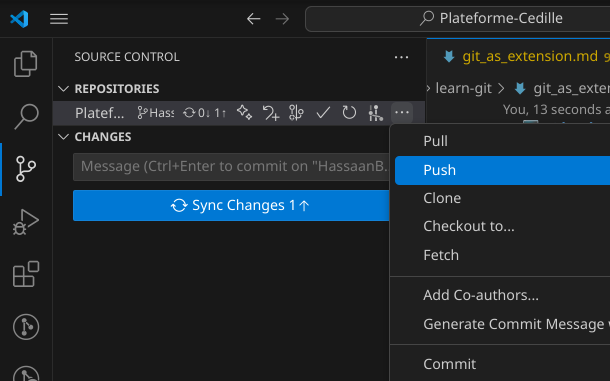

## ⬇️ Récupérer les dernières modifications

CLI:

```bash
git pull origin main
```

VSCode:

Cliquez sur … → Pull

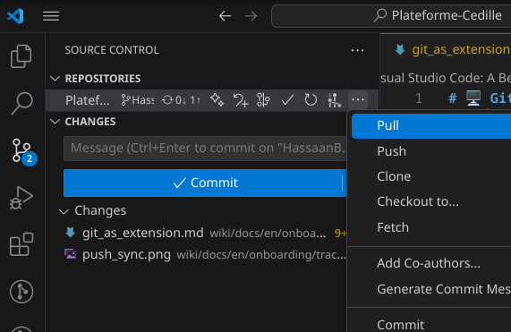

Ou cliquez sur l’icône de synchronisation en bas à gauche

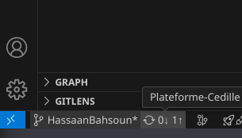

Les conflits, s’il y en a, seront signalés visuellement dans l’éditeur

## 🔄 Fetch (sans fusionner)

CLI:

```bash
git fetch
```

VSCode:

Utilisez … → Fetch pour récupérer les mises à jour distantes sans les fusionner automatiquement

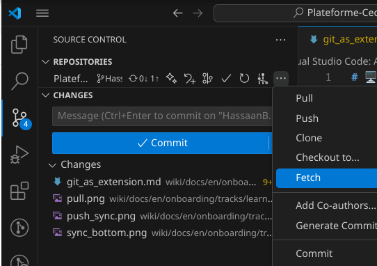

> 🧠 Useful for previewing changes before pulling.
> 🧠 Utile pour prévisualiser les changements avant de faire un pull.

## 🌿 Créer une nouvelle branche

CLI:

```bash
git checkout -b feature/branch-name
```

VSCode:

Cliquez sur le nom de la branche en bas à gauche
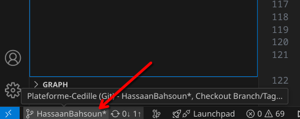

Sélectionnez Create New Branch…
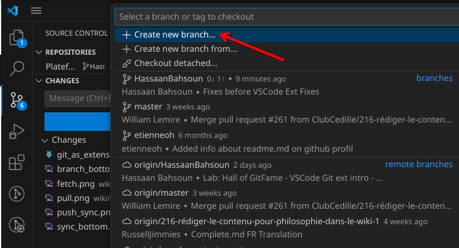

Entrez un nom et sélectionnez la branche de base (généralement main)
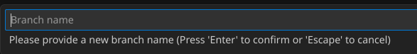

## 🔁 Changer de branche

CLI:

```bash
git checkout branch-name
```

VSCode:

> Cliquez sur le nom de la branche en bas à gauche. Sélectionnez la branche souhaitée dans la liste déroulante
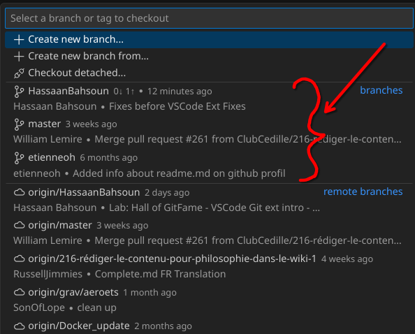
> 🔄 Pas besoin de mémoriser les noms des branches — elles sont listées pour vous.

## 🧹 Supprimer une branche

CLI:

```bash
git branch -d branch-name
git push origin --delete branch-name
```

VSCode:

Allez dans Contrôle de source → ... → Branch
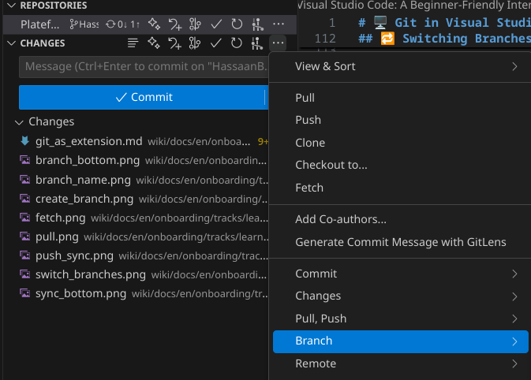

Branch → Delete Branch...
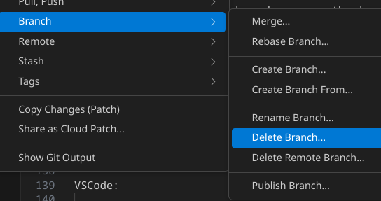

> ⚠️ VSCode demandera une confirmation avant de supprimer localement ou à distance.

## 🔀 Fusionner des branches

CLI:

```bash
git checkout target-branch
git merge source-branch
```

VSCode:

Allez dans Contrôle de source → ... → Branch


Branch → Merge...
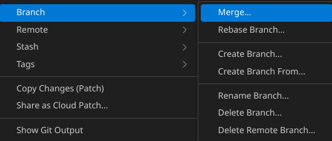

> 📌 VSCode vous alerte des conflits potentiels et permet une résolution côte à côte.

## ⚔️ Résoudre les conflits de fusion

VSCode brille ici grâce à ses outils visuels :

- Les lignes en conflit sont mises en évidence avec :

```diff
+ <<<<<<< HEAD
your changes
=======
incoming changes
+ >>>>>>> other-branch
```

- Des boutons apparaissent au-dessus : Accept Current, Accept Incoming, Accept Both, ou Compare.

Cela rend la résolution des conflits bien plus facile qu’en CLI.

## Conclusion

VSCode rend Git accessible et visuel — parfait pour les débutants

Vous pouvez toujours utiliser la CLI Git à tout moment via le terminal intégré

Apprenez la CLI avec le temps, mais laissez VSCode guider votre flux de travail
au début.

Nous sommes à la fin, passez à la [page suivante](./git_complete.md)
