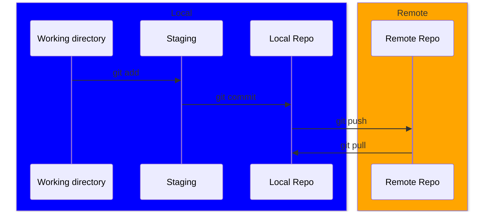

# Introduction au contrôle de version & Git

## Qu’est-ce que le contrôle de version ?

Le contrôle de version (source control) est un système qui aide à **gérer** et **suivre les changements** d’un projet numérique au fil du temps — du code dans notre cas.

Il est particulièrement utile pour nous, car développer un logiciel est un effort d’équipe, et un système est nécessaire pour permettre à chacun de **collaborer** sans écraser les modifications des autres.

De plus, un système de contrôle de version offre un **historique détaillé des changements**, permettant de **revenir** facilement à une version antérieure sans perdre une seule ligne de code.

Vous avez probablement déjà utilisé une forme de contrôle de version si vous avez collaboré en équipe avec la suite bureautique de Google (ex. Docs, Sheets) ! Elle permet la collaboration sur le même document et fournit un historique des modifications.

### Pourquoi avez-vous besoin d’un système de contrôle de version ?

- Collaboration : toute une équipe peut travailler sur le même projet sans se marcher sur les pieds
- Sauvegarde : toute ligne de code poussée dans le contrôle de version y restera pour toujours, quoi qu’il arrive
- Suivi des changements : retrouvez facilement qui a ajouté quoi au projet
- Branches : isolez des fonctionnalités expérimentales sans impacter le projet principal

---

## Git (aperçu rapide)

Un système de contrôle de version n’est qu’un ensemble de concepts que chacun peut implémenter. Pour nous (*et la majorité du monde*), nous utilisons [**Git**](https://git-scm.com/).
> Git est un système de contrôle de version distribué, gratuit et open source, conçu pour gérer des projets de toute taille avec rapidité et efficacité.

Il a été créé en 2005 par Linus Torvalds (créateur de Linux) pour aider les collaborateurs du noyau Linux à travailler ensemble. Il a depuis fait ses preuves et est utilisé par une grande majorité des équipes de développement logiciel.

Il fonctionne très bien pour des projets de toutes tailles, tout en restant efficace. De plus, c’est un système *distribué*, ce qui signifie que chacun possède localement l’historique complet, sans serveur central obligatoire.

### Flux de travail Git

Git possède 3 zones principales où toute l’action se déroule :

1. **Working directory** : ce sont les fichiers réels dans lesquels vous écrivez votre code !

2. **Staging area** : une zone tampon où vos changements sont stockés avant d’être commités.

3. **Repository (local/distant)** : aussi appelé *repo*, c’est là où vos changements sont stockés de façon permanente. Vous avez un dépôt local qui peut différer du dépôt distant puisque Git est un système *distribué*.

Git possède plus de 150 commandes ! Dans notre cas, nous nous concentrerons sur les quatre suivantes, et nous en verrons d’autres plus tard.

1. **`git add`** : ajoute ou déplace un changement du working directory vers la staging area.

2. **`git commit`** : enregistre dans votre dépôt local les changements ajoutés depuis la staging area.

3. **`git push`** : quand vous êtes satisfait de vos changements en local, poussez-les vers le dépôt distant pour les rendre disponibles à tous.

4. **`git pull`** : comme son nom l’indique, récupère les changements du dépôt distant vers votre dépôt local. Si vous avez récemment fait un `git push`, vos collègues devront faire un `git pull` pour les récupérer.

*on peut ignorer `git checkout` pour l’instant.*

---

Quand vous êtes prêt, passez à la [page suivante](intro_github.md) !

