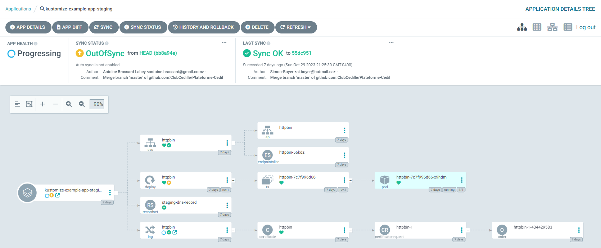

# Déployer des applications de type Workload

## Application exemplaire (httpbin)

L'application d'exemple est mise en place afin de documenter la méthodologie qui devrait être utilisée pour déployer des applications en production avec Kustomize et ArgoCD.

- Code source: [/apps/samples/kustomize-example-app](https://github.com/ClubCedille/Plateforme-Cedille/tree/master/apps/samples/kustomize-example-app)

## Survol des étapes a suivre pour déployer une nouvelle app:

1. Création d'un dossier pour l'application. Ex.: `/apps/new-app`
2. Création de l'arborescence de ressources décrite dans ce document
3. Ajout d'une référence vers la nouvelle application dans l'application de haut niveau `/apps/argo-apps/kustomization.yaml` 

## Fonctionnement avec Kustomize

### Base

Chaque application devrait définir un dossier `base` qui contient toutes les ressources Kubernetes que l'application aurait besoin. Ce dossier doit aussi contenir un Kustomization qui pointe sur toute les fichiers Kubernetes de `base`:

```yaml
# base/Kustomization.yaml
apiVersion: kustomize.config.k8s.io/v1beta1
kind: Kustomization

resources:
  - network.yaml
  - deployment.yaml
```

### Envrionments

Ensuite, il faut définir les dossiers `prod` et `staging` qui auront comme objectif de modifier des propriétés dans `base` selon les besoins différents et d'ajouter des ressources qui ne seront pas communes à tous les environnements.

Par exemple, voici le fonctionnement pour `prod`:

```yaml
# prod/kustomization.yaml
apiVersion: kustomize.config.k8s.io/v1beta1
kind: Kustomization

resources:
  - ../base
  - ingress.yaml
  - dns.yaml

patches:
  - path: patch.yaml
```

Dans l'extrait ci-haut:

1. On inclut le base
2. On inclut les ressources 
3. On applique des `patches`:

```yaml
# prod/patches.yaml
# [...]
      replicas: 3
      containers:
      - name: httpbin
        resources:
          requests:
            cpu: "0.1"
            memory: "256Mi"
---
# On peut mettre d'autres patches avec des séparateurs ---
---
```

On voit qu'ici on applique des requêtes de ressources qui seront différentes de `base`

### Ajout de la nouvelle application dans /argo-apps

Créer les fichiers suivants dans votre répertoire d'application:

```yaml
# argo.yaml : Contiens la ressource ArgoCD "Application" pour votre application
apiVersion: argoproj.io/v1alpha1
kind: Application
metadata:
  name: kustomize-example-app-prod
  namespace: argocd
  annotations:
    argocd.argoproj.io/sync-wave: "2"
spec:
  project: default
  destination:
    server: https://kubernetes.default.svc
    namespace: kustomize-example-app-prod
  source:
    repoURL: https://github.com/ClubCedille/Plateforme-Cedille
    path: apps/samples/kustomize-example-app/prod # On pointe ArgoCD vers notre sous-répertoire pour l'environment prod
    targetRevision: HEAD
  syncPolicy:
    syncOptions:
    - CreateNamespace=true
---
apiVersion: argoproj.io/v1alpha1
kind: Application
metadata:
  name: kustomize-example-app-staging
  namespace: argocd
  annotations:
    argocd.argoproj.io/sync-wave: "2"
spec:
  project: default
  destination:
    server: https://kubernetes.default.svc
    namespace: kustomize-example-app-staging
  source:
    repoURL: https://github.com/ClubCedille/Plateforme-Cedille
    path: apps/samples/kustomize-example-app/staging # On pointe ArgoCD vers notre sous-répertoire pour l'environnement staging
    targetRevision: HEAD 
  syncPolicy:
    syncOptions:
    - CreateNamespace=true
```

```yaml
# kustomization.yaml : Kustomization qui contient une seule référence vers le argo.yaml ci-haut
apiVersion: kustomize.config.k8s.io/v1beta1
kind: Kustomization

resources:
 - argo.yaml
```

Finalement, on peut modifier le fichier `/apps/argo-apps/kustomization.yaml` pour inclure notre nouvelle application:

```yaml
# /apps/argo-apps/kustomization.yaml
kind: Kustomization

resources:
  # System
  - ../../system/crossplane/
  - ../../system/grafana/
  # Workload
  - ../samples/kustomize-example-app/ # Ajout de la nouvelle application.
```

### Structure Globale

**Fichiers et Ressources** :

```
  [argo.yaml] : ArgoCD Application
  [kustomization.yaml] : Pointeur vers argo.yaml
  ── base
  │  ├── [deployment.yaml]  Deployment httpbin
  │  ├── [kustomization.yaml]  Kustomization
  │  └── [network.yaml]  Service httpbin
  ├── prod
  │   ├── [dns.yaml]  RecordSet prod-dns-record
  │   ├── [ingress.yaml]  Ingress httpbin
  │   ├── [kustomization.yaml]  Kustomization
  │   └── [patch.yaml]  Deployment httpbin
  └── staging
      ├── [dns.yaml]  RecordSet staging-dns-record
      ├── [ingress.yaml]  Ingress httpbin
      ├── [kustomization.yaml]  Kustomization
      └── [patch.yaml]  Deployment httpbin
```

**Aperçu dans ArgoCD**
