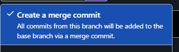

# Guide de contribution

Bienvenue sur le guide de contribution de la plateforme Cedille ! Ce document contient des informations sur la manière dont vous pouvez contribuer à la plateforme Cedille, y compris les meilleures pratiques, les directives de contribution et les ressources utiles.

## Prérequis

Avant de commencer à contribuer à la plateforme Cedille, assurez-vous de respecter les préréquis suivants :

1. **Compte GitHub** : Vous aurez besoin d'un compte GitHub pour contribuer au projet.
2. **Rejoignez notre [organisation GitHub](https://github.com/clubcedille/)** : Pour accéder aux dépôts de la plateforme Cedille, vous devez rejoindre l'organisation GitHub du club Cedille. Pour ce faire, demandez à un membre de l'équipe de vous inviter à rejoindre l'organisation.
3. **Tableau Backlog** : Dans l'onglet [**Projects**](https://github.com/orgs/ClubCedille/projects) du dépôt GitHub du club Cedille, vous trouverez un tableau backlog organisé pour faciliter la gestion des tâches et des projets. Ce tableau présente une vue d'ensemble des tâches disponibles, classées par catégories telles que les fonctionnalités à développer, les bogues à corriger, ou les améliorations à apporter. Chaque tâche est accompagnée d'une description, d'une priorité, et d'une estimation du temps nécessaire. Vous pouvez consulter ce tableau pour identifier les tâches qui correspondent à vos compétences ou à vos intérêts, et choisir celles sur lesquelles vous souhaitez travailler. Cette approche vous permet de contribuer de manière autonome tout en assurant que les projets avancent de manière cohérente et organisée.


## Comment contribuer aux divers projets ✍️

Pour contribuer à l'un de nos projets, suivez les étapes ci-dessous et envoyez-nous votre nom d'utilisateur GitHub pour vous ajouter à notre organisation :

1. **Clonez le projet localement** : Utilisez la commande `git clone` pour cloner le projet sur votre machine. Exemple : 
   ```sh
   git clone https://github.com/ClubCedille/cedille.etsmtl.ca.git
   ```
   Cette commande télécharge une copie complète du dépôt sur votre machine locale, vous permettant de travailler hors ligne.

2. **Ouvrez le projet avec votre IDE** : Utilisez votre IDE préféré pour ouvrir le projet cloné. Un IDE (Environnement de Développement Intégré) comme Visual Studio Code, IntelliJ IDEA ou autre vous aidera à éditer le code et à gérer vos modifications de manière plus efficace.

3. **Créez une nouvelle branche** : Avant de commencer à travailler sur des modifications, créez une nouvelle branche pour vos contributions avec la commande 
   ```sh
   git branch [branch_name]
   ```
   Puis passez à cette branche avec 
   ```sh
   git checkout [branch_name]
   ```
   La création de branches permet de travailler sur des fonctionnalités ou des corrections spécifiques sans affecter la branche principale du projet.

4. **Effectuez vos modifications** : Apportez les modifications nécessaires dans votre environnement de développement. Après avoir terminé, enregistrez vos changements avec la commande 
   ```sh
   git commit -am “décrivez vos modifications ici”
   ```
   Il est important d'écrire des messages de commit clairs et descriptifs pour faciliter la compréhension des modifications apportées.

5. **Poussez votre branche** : Envoyez votre branche vers le dépôt distant avec 
   ```sh
   git push -u origin [nom_de_branche]
   ```
   Le drapeau `-u` configure la branche locale pour suivre la branche distante, facilitant ainsi les futures synchronisations.

6. **Ouvrez une Pull Request** : Sur le site GitHub, naviguez jusqu’à votre branche et cliquez sur “New pull request” pour ouvrir une nouvelle demande. Remplissez le modèle de demande de Pull Request avec une brève description de vos modifications et soumettez-le pour examen. Assurez-vous de sélectionner au moins un membre du club pour examiner la demande. 

7. **Examen et fusion** : Une fois la demande examinée et approuvée, fusionnez la branche avec la branche principale en utilisant l'une des options suivantes :


      - **Fusion manuelle via la ligne de commande git** :
         ```sh
         git merge [branch_name] --no-ff
         ```
      - **Fusion via l'interface utilisateur de GitHub** : Sur la page de la Pull Request, utilisez le bouton approprié qui apparaîtra une fois votre commit approuvé.

         


8. **Maintenez votre copie à jour** : Avant de commencer à travailler, assurez-vous de récupérer les dernières modifications du projet en utilisant 
   ```sh
   git pull origin main
   ```
   Cela garantit que vous travaillez avec la version la plus récente du code et évite les conflits de fusion.

9. **Utilisez des outils graphiques si nécessaire** : Si vous trouvez que la ligne de commande est difficile à gérer, envisagez d'utiliser une interface graphique git comme GitKraken ou SourceTree. Ces outils offrent une interface visuelle pour gérer vos commits, branches, et demandes de Pull Request, rendant la gestion du code plus intuitive.
